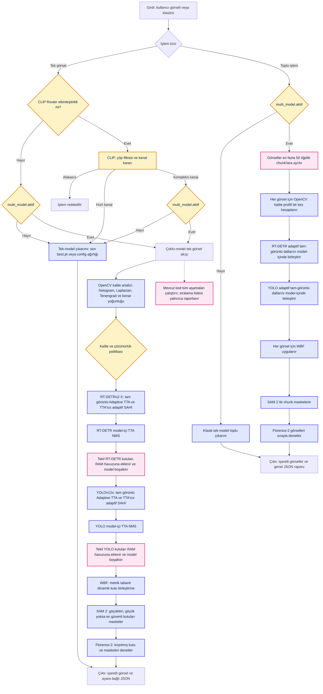

# Hades Scanner (Hasar Tespit Sistemi)

> **Bu proje, Soft İş Çözümleri bünyesinde hazırlanmış bir staj projesidir.**  
> **Oluşturulma Tarihi: 14.07.2026**

Bu proje, görüntü işleme ve derin öğrenme (YOLO / RT-DETR) algoritmaları kullanarak araçlar üzerindeki fiziksel hasarları (Çizik, Göçük, Cam Kırığı, Pas, Kuş Pisliği, Far Kırığı, Patlak Lastik) tespit etmek amacıyla geliştirilmiş uçtan uca bir yapay zeka sistemidir.


Sistem, **Çoklu Model (Multi-Model) Mimarisi** ile donatılmıştır: Kutu çıkarımı için **RT-DETRv2-X** ve **YOLOv12x**, piksel seviyesinde göçük maskelemesi için **SAM 2**, son denetim ve nihai etiketleme için ise Microsoft'un VLM'i **Florence-2** ardışık olarak çalışır. Modeller RAM havuzu üzerinden birbirine veri aktarır; her model işi bitince bellekten silinerek VRAM optimize edilir.

---

## Model Performansı ve Başarım Durumu (Eğitim Sonuçları)

Model eğitimleri Google Colab üzerinde NVIDIA A100 GPU (80GB VRAM) kullanılarak gerçekleştirilmiştir:

| Model Mimarisi | Epoch / Tur | mAP50 (Genel Başarı) | Precision (Nokta Atışı) | Recall (Hasar Yakalama) | mAP50-95 (Milimetrik Çizim) | Durum |
|---|---|---|---|---|---|---|
| **RT-DETR-x** | 69 Epoch | **%96.5 (0.965)** | **%95.3 (0.953)** | **%94.6 (0.946)** | **%86.6 (0.866)** | **Entegre Edildi (`rtdetr-v2-x.pt`) / Şampiyon** |
| **YOLOv12x** | 130 Epoch | **%93.7 (0.937)** | **%94.6 (0.946)** | **%89.8 (0.898)** | **%82.2 (0.822)** | **Entegre Edildi (`yolov12x.pt`)** |
| **Florence-2-base + HADES LoRA (VLM)** | 8 Epoch | VQA / Sınıflandırma | - | - | - | **Entegre Edildi (`models/florence_hades_lora`)** |

> **Güncelleme Notu:** A100 GPU üzerinde 69 tur boyunca eğitilen ve **%96.5 mAP50** ile **%86.6 mAP50-95** rekor başarıya ulaşarak projenin en yüksek performanslı modeli olan `rtdetr-v2-x.pt` projeye entegre edilmiştir. Ayrıca **%93.7 mAP50** ile `yolov12x.pt` ve sekiz epoch eğitilen HADES Florence-2 LoRA adaptörü çoklu model zincirinde yerini almıştır.

### Florence-2 Fine-Tune İş Akışı

Florence-2, YOLO etiket koordinatlarıyla ana görselden dinamik olarak kırpılan hasarlı bölgeyi ve `<DETAILED_CAPTION>` görevini birlikte alarak projedeki yedi sınıftan birini (`Cizik`, `Gocuk`, `Cam Kirigi`, `Pas`, `Kus Pisligi`, `Far Kirigi`, `Patlak Lastik`) üretecek şekilde sekiz epoch eğitilmiştir. Nihai PEFT adaptörü `models/florence_hades_lora` dizinine yerleştirilmiş ve `config.yaml` üzerinden denetleyiciye bağlanmıştır.

[Florence-2 Colab notebook'u](notebooks/florence2_colab_egitim.ipynb) veri arşivini açma, YOLO koordinatlarını piksele çevirip hasar bölgelerini kırpma, veriyi yüzde 85 eğitim ve yüzde 15 doğrulama olarak ayırma ve çıktıları Google Drive'a kaydetme adımlarını otomatik yürütür. Ana model ağırlıkları dondurulmuş; `q_proj`, `k_proj`, `v_proj` ve `out_proj` dikkat katmanlarına `r=16`, `lora_alpha=32` değerleriyle LoRA uygulanmıştır. Çıkarım sırasında yerel işlemci dosyaları yüklenir, `microsoft/Florence-2-base` taban modeli açılır ve `adapter_model.safetensors` PEFT aracılığıyla taban modelin üzerine bağlanır. Taban model ilk kullanımda Hugging Face üzerinden indirilir ve sonraki kullanımlar için yerel önbellekte tutulur.

---

Ayrıca sistem, **CLIP tabanlı Akıllı Yönlendirici (AI Router)** mimarisi ile korunur: Kullanıcı fotoğraf yüklediğinde CLIP modeli önce görüntüyü çöp filtresinden geçirir (selfie, fatura, hayvan vb. alakasız görseller engellenir), ardından temiz görselleri içeriklerine göre en uygun kanala yönlendirir — yakın çekim parçalar (lastik, far) hızlı **YOLO** kanalına, geniş açı kaporta hasarları ise ağır **RT-DETR** çoklu-model akışına sevk edilir.

---

## Ön Koşullar

| Gereksinim | Minimum | Önerilen |
|---|---|---|
| Python | 3.10+ | 3.11 |
| RAM | 8 GB | 16 GB+ |
| Disk Alanı | 5 GB | 10 GB+ (modeller için) |
| GPU (isteğe bağlı) | NVIDIA 4 GB / Intel Arc 4 GB / AMD 4 GB VRAM | NVIDIA 8 GB+ (CUDA) veya Intel Arc / AMD (DirectML) |
| GPU Yazılımı | - | CUDA 11.8+ (NVIDIA) veya `torch_directml` (Intel/AMD) |
| İşletim Sistemi | Windows 10 / Linux / macOS | Windows 11 |

> **Not:** GPU olmadan da CPU üzerinde eğitim ve çıkarım yapabilirsiniz, sadece daha yavaş olacaktır. Sistem GPU'yu otomatik tespit eder, bulamazsa CPU'ya düşer.
>
> **Intel Arc / AMD GPU kullanıcıları:** `pip install torch_directml` ile DirectML kurulumu yapın. Bu, DirectX 12 üzerinden GPU hızlandırması sağlar ve Windows'taki en sorunsuz çözümdür.

### Bağımlılıklar

Projede kullanılan başlıca paketler (`requirements.txt`):

| Paket | Görev |
|---|---|
| `ultralytics` | YOLO/RT-DETR model eğitimi ve çıkarımı |
| `torch` / `torchvision` | PyTorch derin öğrenme altyapısı |
| `torch_directml` | **(Opsiyonel)** Intel Arc / AMD / NVIDIA GPU hızlandırması (DirectX 12) |
| `opencv-python` | Görüntü işleme ve bounding box çizimi |
| `numpy` | Sayısal dizi işlemleri ve görsel kodlama/çözme |
| `albumentations` | Veri artırımı (augmentation) |
| `labelImg` | Görsel etiketleme aracı |
| `psutil` / `py-cpuinfo` | Donanım kaynak takibi |
| `pyyaml` | YAML yapılandırma dosyası okuma/yazma |
| `colorama` | Renkli terminal çıktısı |
| `icrawler` | Google/Bing'den otomatik görsel indirme |

---

## Hızlı Başlangıç (İlk Çıkarımınızı 5 Adımda Yapın)

```bash
# 1. Depoyu klonlayın ve proje klasörüne girin
git clone https://github.com/mecik-arda/hasar-tespit && cd hasar-tespit

# 2. Bağımlılıkları yükleyin
pip install -r requirements.txt

# 3. Görsellerinizi hasar-ornek/ klasörüne atın
#    (jpg, jpeg, png, bmp, webp formatları desteklenir)

# 4. Ana menüyü başlatın
python main.py

# 5. Önerilen İş Akışı:
#    1. Donanım ve Model (1, 9)
#    2. Orkestrasyon ve Profil Seçimi (10, 11)
#    3. Veri Hazırlığı (2, 3, 4)
#    4. Eğitim ve Çıkarım (5, 6)
```

> **İpucu:** Eğer sadece sistemi test etmek istiyorsanız, `hasar-ornek/` klasöründe örnek araç fotoğrafları zaten mevcuttur.

---

## Kurulum

Projeyi çalıştırmadan önce gerekli bağımlılıkları yüklemeniz gerekmektedir:

```bash
pip install -r requirements.txt
```

### GPU Desteği Kurulumu

Model eğitiminde GPU donanım hızlandırmasından yararlanmak için sisteminizdeki GPU'ya uygun PyTorch sürümünü kurmanız önerilir:

**NVIDIA GPU (CUDA):**
```bash
# CUDA 11.8 için:
pip install torch torchvision --index-url https://download.pytorch.org/whl/cu118

# CUDA 12.1 için:
pip install torch torchvision --index-url https://download.pytorch.org/whl/cu121
```

**Intel Arc GPU (DirectML - Önerilen):**
```bash
# DirectX 12 üzerinden GPU hızlandırması. En sorunsuz Windows çözümü.
pip install torch_directml
```

**AMD Radeon GPU:**
```bash
# Windows (DirectML):
pip install torch_directml

# Linux (ROCm):
pip install torch torchvision --index-url https://download.pytorch.org/whl/rocm5.7
```

> **Not:** Intel Arc GPU'lar için XPU (Intel Extension for PyTorch) şu an Windows'ta
> pip üzerinden çalışmamaktadır. Detaylı teknik rapor için: [`docs/XPU_INTEL_ARC_RAPORU.md`](docs/XPU_INTEL_ARC_RAPORU.md)
> Önerilen alternatif: **DirectML** (`pip install torch_directml`).

GPU'nuzun doğru tespit edildiğini doğrulamak için:
```bash
python main.py   # ardından menüden [1] Donanım Kontrolü'nü seçin
```

---

## Proje Dizini ve Modüller

Projede yer alan temel modüller ve görevleri aşağıda açıklanmıştır:

### `main.py`
Projenin ana giriş noktasıdır. Kullanıcıya interaktif bir Komut Satırı Arayüzü (CLI) sunar. Bütün alt modüllere buradan tek tuşla erişilir. Menü seçenekleri Rünik kategoriler altında `0` ile `16` arasında gruplandırılmıştır. Donanım kontrolü sırasında eğitim ve çıkarım için ayrı ayrı cihaz seçimi yapılır. Çoklu-Model aktifken bazı menüler (Örn: Tekil Model Seçimi) akıllıca gizlenir veya yönlendirilir.

### `src/hardware_check.py`
Sistem kaynaklarını optimize etmekle görevlidir. Tüm GPU (NVIDIA, AMD, Intel Arc) ve NPU donanımlarını tespit eder, DirectML desteğini kontrol eder, Entegre/Harici ayrımı yapar. İçerisinde yer alan fonksiyonlar:
* `cpu_bilgisi_al()` / `ram_bilgisi_al()`: İşlemci ve bellek bilgilerini toplar.
* `nvidia_gpu_bilgisi_al()`: NVIDIA GPU'ları nvidia-smi üzerinden tespit eder.
* `torch_cuda_bilgisi_al()`: PyTorch CUDA kullanılabilirliğini denetler.
* `directml_bilgisi_al()`: DirectML (DirectX 12) GPU hızlandırmasının kullanılabilirliğini kontrol eder. Intel Arc, AMD Radeon ve NVIDIA GPU'ları tek bir çatı altında destekler.
* `wmic_gpu_bilgisi_al()`: Windows üzerinde PowerShell Get-CimInstance ile tüm GPU'ları (NVIDIA, AMD, Intel) tarar, WMIC fallback'li.
* `intel_arc_gpu_bilgisi_al()`: Eğitim yapabilen Intel Arc GPU'ları ayrıca belirler.
* `npu_bilgisi_al()`: Intel AI Boost, AMD Ryzen AI gibi NPU işlemcileri tespit eder.
* `tum_gpu_bilgisi_al()`: Sistemdeki tüm GPU'ları tek listede toplar.
* `egitim_yapabilir_gpu_var_mi()`: CUDA, DirectML, Intel Arc veya AMD Radeon gibi eğitim yapabilecek GPU'nun varlığını kontrol eder.
* `donanim_profili_olustur()`: Tüm donanım verilerini toplayarak optimum batch size, hedef cihaz ve eğitim önerisi oluşturur. DirectML varsa CUDA'dan sonra ikinci öncelikte değerlendirir.
* `donanim_ozeti_yazdir()`: Toplanan bilgileri GPU 0, GPU 1 şeklinde numaralandırarak CLI'da formatlı sunar. DirectML ve NPU tespit edilmişse ayrıca gösterir.
* `cihaz_secimi_yap(profil, mod)`: Kullanıcıya mevcut GPU/CPU/NPU seçeneklerini listeler. DirectML varsa **"DirectML GPU (Önerilen)"** olarak en üst sırada sunar. `mod="egitim"` modunda NPU seçenek olarak gösterilmez (uyarı verilir), `mod="cikarim"` modunda NPU seçilebilir hale gelir.

### `src/utils.py`
Proje genelinde kullanılan ortak sabitler ve yardımcı fonksiyonları barındırır (DRY prensibi):
* `yapilandirma_yukle()`: `config.yaml` dosyasını ayrıştırır, sonucu bellekte cache'ler. Tekrarlanan disk okumalarını engeller.
* `yapilandirma_kaydet()`: Yapılandırma dict'ini `config.yaml` dosyasına yazar, cache'i günceller.
* `_directml_cihazini_al()`: DirectML GPU cihazını tespit eder, sonucu cache'ler.
* `_openvino_kullanilabilir_mi()`: OpenVINO paketinin yüklü olup olmadığını kontrol eder.
* `SINIF_RENKLERI`: 7 hasar sınıfı için BGR formatında renk sabitleri (OpenCV uyumlu).
* `PROJE_KOKU`, `YAPILANDIRMA_YOLU`, `EGITIM_KOKU` gibi proje geneli yol sabitleri.

### `src/data_tools.py`
Veri hazırlama ve işleme süreçlerinin omurgasıdır. Şu fonksiyonları içerir:
* `yapilandirma_yukle()`: `config.yaml` dosyasını ayrıştırır (→ `src/utils.py` üzerinden).
* `etiketleme_baslat()`: Kullanıcının resimleri etiketleyebilmesi için arka planda `labelImg` aracını başlatır.
* `augmentation_uygula()`: Albumentations kütüphanesi yardımıyla mevcut eğitim setini döndürme, parlaklık/kontrast değişimi, yatay/dikey çevirme, Gauss gürültüsü ve bulanıklaştırma teknikleriyle çoğaltır.
* `veri_bol()`: Etiketlenen veri setini eğitim (%80) ve doğrulama (%20) olmak üzere ikiye ayırarak modelin eğitilmesine hazır hale getirir. Klasörler arasında `shutil.move` ile hızlı taşıma yapar. İşlem sonunda `data/dataset.yaml` dosyasını otomatik oluşturur.
* `veri_kalite_kontrolu()`: Görselleri tarayarak bozuk dosya, düşük çözünürlük, tekdüze piksel ve MD5 hash ile yinelenen görsel tespiti yapar.
* `gorsel_indir()`: `icrawler` kütüphanesi ile Google'dan sınıf bazlı otomatik görsel toplar. Arama terimleri `config.yaml`'daki `veri.arama_terimleri` alanından okunur.
* `roboflow_indir()`: Roboflow Universe'den YOLO formatında hazır veri seti indirir. API anahtarı ve proje yolu ile kullanılır.

### `src/train.py`
Modelin eğitilmesi ve raporlanmasından sorumludur:
* `egitim_baslat()`: Girdi parametrelerini (epoch, batch, img_size, fl_gamma) yapılandırır ve seçili modeli (YOLO veya RT-DETR) transfer öğrenimi (transfer learning) yöntemiyle eğitmeye başlar. Model türüne göre `YOLO()` veya `RTDETR()` sınıfını otomatik seçer. Google Colab seçilirse yönlendirme yapar. Çökmeleri önlemek için negatif girdilerde varsayılan değerlere döner.
* `egitim_raporu_goster()`: Tamamlanan eğitimin ardından oluşan metrik dosyalarını (`results.csv`, `args.yaml`) bularak terminale yazdırır (mAP, precision, recall, loss değerleri).
* `model_bilgisi_goster()`: Son eğitim tarihi, model dosyası boyutu, en iyi/son epoch doğruluk metriklerini (mAP50, mAP50-95, precision, recall) gösterir.

### `src/pipeline.py`
Eğitilmiş model üzerinden çıkarım (inference) işlemlerini yürütür. YOLO ve RT-DETR modellerini otomatik tanır:
* `egitilmis_model_yolu_bul()`: Son çalıştırılan eğitimden kalan en iyi model ağırlığını (`best.pt`) arar, bulamazsa config.yaml'daki ağırlığa düşer.
* `hasar_tespiti_yap()`: Verilen tekil bir görüntüyü modele sokarak tespit edilen hasar koordinatlarını (bounding box) çizer ve sonuçları JSON + işaretli görsel olarak kaydeder.
* `toplu_hasar_tespiti_yap()`: **`hasar-ornek`** klasöründeki fotoğrafları topluca okuyup otomatik işler ve etiketlenmiş sonuçları tek bir genel JSON raporu eşliğinde **`hasar-sonucu`** klasörüne yazar.
* `coklu_model_hasar_tespiti_yap()`: **Çoklu Model Mimarisi** ile tekil görselde hasar tespiti yapar. RT-DETRv2-X → YOLOv12x → WBF birleştirme → SAM 2 maskeleme → Florence-2 denetimi ardışık zincirini çalıştırır. Her model işi bitince `del model` + `gc.collect()` ile bellekten silinir, VRAM optimize edilir. VRAM dolarsa otomatik CPU'ya düşer (Auto-Fallback).
* `coklu_model_toplu_tespiti_yap()`: Çoklu model mimarisini klasördeki birden fazla görsel için toplu (batch) olarak çalıştırır.
* `_wbf_kutu_birlestir()`: Metrik tabanlı dinamik ve sabit sınıf ağırlıklandırması destekli Weighted Boxes Fusion (WBF) algoritması ile RT-DETR ve YOLO'dan gelen üst üste binen kutuları teke düşürür. En yüksek sınıf veya genel mAP değerine sahip model yapılandırılmış azami ağırlığı alır; metrik bulunamazsa sabit sınıf ağırlığına dönülür.
* `_sahi_tarama()`: Önce tam görüntü çıkarımı yapar, ardından görüntü boyutuna göre hesaplanan örtüşmeli dilimleri yalnızca küçük hasar sınıfları için tarar. Tam görüntü ve dilim tahminlerini sınıf bazlı NMS ile birleştirir; SAHI kullanılamazsa tam görüntü sonucunu korur.
* `_adaptif_tta_tarama()`: Kalite analizinin seçtiği en fazla üç tam-görüntü varyantını aynı modelde çalıştırır, dönüştürülmüş kutuları orijinal koordinatlara taşır ve model-içi sınıf bazlı NMS ile tek tahmin kümesine indirir. Bu sayede ana WBF'de model oy dengesi korunur.
* `_model_bosalt()`: İşlemi biten modeli RAM/VRAM'den temizler, `gc.collect()` ve `torch.cuda.empty_cache()` çağırır.

### `src/adaptive_tta.py`
Görüntü kalitesini CLIP kullanmadan OpenCV ile analiz eder ve bozulma türüne uygun TTA varyantlarını hazırlar:
* `gorsel_kalitesini_analiz_et()`: En-boy oranı korumalı sabit uzun kenar ve letterbox normalizasyonundan sonra parlaklık histogramı, siyah/beyaz kırpılma oranı, Laplacian varyansı, Tenengrad enerjisi ve kenar yoğunluğunu ölçer.
* `tta_varyantlarini_olustur()`: Karanlık görüntülerde gamma ve LAB parlaklık kanalında CLAHE; bulanık görüntülerde `1.25x` ölçek ve yatay çevirme; aşırı parlak görüntülerde kontrollü gamma varyantı üretir.
* `tta_tahminini_orijinale_tasi()`: Ölçeklenmiş veya yatay çevrilmiş görüntüdeki kutuları orijinal görüntü koordinatlarına dönüştürür.

### `src/inspector_florence.py`
Microsoft Florence-2 Vision-Language Model (VLM) ile son denetim ve etiketleme yapan bağımsız modüldür:
* `denetle()`: RAM havuzundaki kutu ve maske bölgelerini (crop) Florence-2'ye iletir. Model her bölgeye bakarak nihai sınıf etiketini (Örn: "Göçük", "Çizik") belirler. Auto-Fallback ile VRAM dolumunda CPU'ya kayar.
* `_florence_modeli_yukle()`: Yerel HADES LoRA adaptörünü Florence-2-base taban modeline PEFT ile bağlar ve modeli CUDA/DirectML/CPU backend'lerinden uygun olanla yükler.
* `_florence_modelini_bosalt()`: Florence-2 modelini bellekten tamamen temizler.
* `_hasar_siniflandir()`: Florence-2'nin metin çıktısını (Örn: "dent", "scratch") proje sınıf adlarına (Örn: "Gocuk", "Cizik") eşler.

### `src/benchmark.py`
Uçtan uca performans, doğruluk, bellek ve backend değerlendirmesini yürütür:
* `tekil_model_benchmark_calistir()`: Model yükleme ve ilk çıkarımı soğuk başlangıç olarak, aynı model örneğiyle sonraki çıkarımları sıcak çalışma olarak ölçer.
* `coklu_model_benchmark_calistir()`: RT-DETR, YOLO, WBF, SAM 2 ve Florence-2 aşamalarını ayrı ayrı ölçer; modelleri sıcak turlar arasında bellekte tutar.
* `etiketli_dogruluk_benchmark_calistir()`: YOLO etiketlerini okuyarak sınıf duyarlı Precision, Recall, TP, FP, FN, mAP50 ve mAP50-95 metriklerini hesaplar.
* `donanim_backend_benchmark_calistir()`: PyTorch CPU, CUDA, DirectML ve OpenVINO backend'lerini güvenli biçimde yoklar ve yalnızca kullanılabilir olanları çalıştırır.
* `bellek_olcu_al()`: Süreç RAM'i, sistem RAM'i ve kullanılabiliyorsa CUDA VRAM değerlerini toplar.
* `rapor_kaydet()`: Sonuçları `runs/benchmark/` altında zaman damgalı JSON ve Markdown raporlarına kaydeder.

### `src/advanced_benchmarks.py`
Çevresel dayanıklılık, hiperparametre arama, hata analizi ve yük testlerini yürütür:
* `dayaniklilik_benchmark_calistir()`: Etiketli görsellerde karanlık, parlama, hareket bulanıklığı, sis ve Gauss gürültüsünü üç şiddet düzeyinde deterministik olarak uygular; temel mAP değerine göre kaybı ölçer.
* `tta_kalibrasyon_benchmark_calistir()`: Karanlık, parlama ve hareket bulanıklığı seviyelerinde TTA kapalı/açık mAP50 ile gecikmeyi karşılaştırır. Eşleşmiş bootstrap ile yüzde 95 güven aralığı üretir; yalnızca `delta mAP50 > 0.02`, güven aralığı alt sınırı sıfırdan büyük ve gecikme bütçesi uygun olduğunda etkinleştirme önerir.
* `wbf_grid_search_calistir()`: Dedektör çıktılarını bir kez önbelleğe alır, WBF IoU ve güven eşikleri için 99 kaba kombinasyonu tarar ve istenirse en iyi bölgede `0.01` çözünürlüklü ince arama yapar. Önerileri raporlar, `config.yaml` dosyasını değiştirmez.
* `sinif_karisiklik_matrisi_calistir()`: Normalize karışıklık matrisi, sınıf bazlı TP/FP/FN değerleri ve yanlış sınıflandırmaların ortalama IoU oranlarını üretir.
* `eszamanlilik_stres_testi_calistir()`: `ThreadPoolExecutor` ile 5, 10 ve 20 iş parçacıklı yük seviyelerini RAM/VRAM ön kontrolünden sonra ölçer; throughput, p95 gecikme ve olası bellek sızıntısını raporlar.
* `vlm_dogrulama_benchmark_calistir()`: Artırılmış verileri dışarıda bırakarak sınıflar arasında dengeli Florence-2 doğruluk örnekleri ve hasarsız arka plan kırpımlarında halüsinasyon oranı üretir.
* `gelismis_benchmark_suitini_calistir()`: Dayanıklılık, Adaptive TTA kalibrasyonu, WBF araması, karışıklık matrisi, eşzamanlılık ve VLM doğrulamasını tek çalıştırmada birleştirir; `runs/benchmark/` altında JSON ile Markdown raporu oluşturur.

### `src/validator.py`
Etiketleme sonrası kalite kontrol ve tutarlılık denetimi yapar. 7 aşamalı otomatik kontrol:
* `etiket_format_kontrolu()`: Her `.txt` satırında tam 5 YOLO değeri var mı?
* `etiket_sinir_kontrolu()`: Tüm koordinatlar 0.0-1.0 aralığında mı?
* `etiket_sinif_kontrolu()`: Sınıf ID'leri geçerli aralıkta mı?
* `etiket_boyut_kontrolu()`: Bounding box'lar çok küçük (<%1) veya çok büyük (>%95) değil mi?
* `etiket_overlap_kontrolu()`: Aynı görselde kutular %80'den fazla örtüşüyor mu? (çift etiket)
* `etiket_eslesme_kontrolu()`: Her görselin etiketi, her etiketin görseli var mı?
* `etiket_dagilim_raporu()`: Sınıf başına etiket sayısı ve dağılım grafiği.
* `etiket_validator_calistir()`: Tüm kontrolleri sırayla çalıştıran ana fonksiyon.

### `notebooks/`
* `hades_colab_egitim.ipynb`: Google Colab üzerinde T4 GPU ile model eğitimi için hazır notebook. YOLO/RT-DETR seçimi, Drive entegrasyonu ve eğitimli model indirme içerir.

### `src/export.py`
Eğitilmiş modeli donanıma özel optimize formatlara dönüştürür:
* `model_dışa_aktar()`: Belirtilen formatta (ONNX, TensorRT, OpenVINO, CoreML, TFLite) dışa aktarım yapar.
* `optimize_edilmis_model_olustur()`: Donanım profiline göre en uygun formatı otomatik seçer (NVIDIA GPU → TensorRT, Intel CPU → OpenVINO, diğer → ONNX).

> **Not:** Model dışa aktarımı şu an yalnızca komut satırından çalışır: `python src/export.py optimize`

### `testler/` Klasörü
Projenin sınırlarını ve hata yönetimini doğrulayan 18 adet unittest modülünü barındırır (toplam 140 test):
* `test_donanim.py` — CPU/RAM/GPU/NPU profil yapısı, GPU Entegre/Harici ayrımı, cihaz seçimi (10 test)
* `test_veri_araclari.py` — config.yaml bütünlüğü, model.tur geçerliliği ve sınıf sayısı kontrolü (3 test)
* `test_menu.py` — Menü 0-17 aralığı, model seçimi, çoklu-model alt seçimleri, orkestrasyon (11 test)
* `test_benchmark.py` — Bellek ölçümü, veri sızıntısı filtresi, mAP hesaplaması, pipeline zamanlaması ve çift rapor üretimi
* `test_advanced_benchmarks.py` — Sentetik bozulmalar, önbellekli WBF araması, karışıklık matrisi, eşzamanlı adaptör, VLM skorları ve gelişmiş rapor üretimi
* `test_validator.py` — Etiket format, sınır, sınıf ID, boyut, overlap, eşleşme ve dağılım kontrolleri (14 test)
* `test_gateway.py` — CLIP tabanlı Akıllı Yönlendirici çöp filtresi, kanal yönlendirme, yedek mod (16 test)
* `test_pipeline_multi.py` — Çoklu model (RT-DETR + YOLO + SAM 2 + Florence-2) orkestrasyon entegrasyonu
* `test_wbf.py` — Weighted Boxes Fusion birleştirme algoritması (IoU eşiği, güven skoru, çakışma)
* `test_dinamik_esik.py` — Dinamik güven eşiği ve sınıf bazlı eşik ayarlama
* `test_cli_orchestration.py` — CLI orkestrasyon komutları ve profil yönetimi
* `test_capraz_sorgulama.py` — Çapraz model sorgulama ve sonuç karşılaştırma
* `test_performans.py` — Model optimizasyon süresi ve başarı durumu
* `test_dayaniklilik.py` — Karanlık ve gürültülü görsellerde kararlılık, Türkçe karakterli yollar
* `test_gecersiz_girdi.py` — Boş, sahte ve olmayan dosyalarda hata yönetimi
* `test_egitim_akisi.py` — Sanal verilerle eğitim döngüsü ve ağırlık oluşumu
* `test_veri_artirimi_dagilimi.py` — Bounding box koordinat sınır kontrolü (0.0-1.0)
* `test_cikarim_tutarliligi.py` — PyTorch model çıkarım tutarlılığı
* `test_yuk_ve_es_zamanlilik.py` — Çoklu iş parçacığı (multithreading) stres testi
* `test_limitler.py` — Negatif ve geçersiz konfigürasyon girdilerinde varsayılana dönüş

---

## Menü Kullanım Kılavuzu

Sistemi başlatmak için terminalinizde aşağıdaki komutu çalıştırmanız yeterlidir:

```bash
python main.py
```

Açılan menü Rünik kategorilere (ᛟ, ᛉ, ᛏ, ᛤ) ayrılmış olup `1`'den `17`'ye kadar mantıksal bir sırayla dizilmiştir.
**Önerilen İş Akışı:** 1 → 9 → 10 → 11 → 2 → 3 → 4 → 5 → 6

| Kategori | Menü | Açıklama |
|---|---|---|
| **ᛟ DONANIM** | `[1]` Donanım Kontrolü | GPU/CPU/NPU donanımını listeler ve cihaz seçimi yaptırır |
| | `[9]` Eğitilecek Ana Model | Tekil model modu için YOLO/RT-DETR mimarisini seçtirir |
| **ᛉ VERİ HAZIRLAMA** | `[2]` Veri Etiketleme | `hasar-ornek/` klasöründe LabelImg uygulamasını başlatır |
| | `[3]` Veri Artırımı | Görselleri parlaklık, rotasyon gibi yöntemlerle çoğaltır |
| | `[4]` Veri Bölme | Verileri %80 train / %20 val olarak böler, klasörleri hazırlar |
| **ᛏ EĞİTİM** | `[5]` Model Eğitimini Başlat | Transfer öğrenimi ile seçili modelin eğitimini başlatır. Çoklu modeldeyken hangi alt modeli eğiteceğinizi sorar |
| **ᛤ ÇIKARIM** | `[6]` Hasar Tespiti Yap | Tekil veya toplu görselde (Multi-Model aktifse tüm modelleri zincirleme kullanarak) hasar tespiti yapar |
| **ᛟ RAPORLAMA** | `[7]` Eğitim Performans Raporu | Son eğitimin mAP, precision, recall metriklerini gösterir |
| | `[8]` Sistem Testlerini Çalıştır | Tüm birim (120+ test) ve entegrasyon testlerini koşturur |
| **ᛉ ORKESTRASYON** | `[10]` Orkestrasyon Yöneticisi | Çoklu-Model ağırlık dosyalarını (YOLO, RT-DETR, SAM2, Florence) belirler |
| | `[11]` Çıkarım Profili Seçimi | Hızlı, Hibrit, Kusursuz veya Özel profil seçimlerini yaptırır |
| **ᛏ VERİ TOPLAMA** | `[12]` Görsel Toplama | Otomatik olarak internetten hasarlı araç görseli indirir |
| | `[13]` Veri Kalite Kontrolü | Görsellerdeki bozuk/düşük çözünürlüklü olanları tarar |
| | `[14]` Etiket Doğrulama | Etiketleri %80 overlap, boyut ve sınıf bazında 7 aşamada denetler |
| **ᛤ BİLGİ** | `[15]` Model Bilgileri | Son eğitim tarihi, model boyutları ve parametrelerini gösterir |
| **ᛟ YÖNLENDİRİCİ** | `[16]` Akıllı Yönlendirici (Gateway) Testi | CLIP modeli ile çöp filtresi ve kanal yönlendirme testini çalıştırır |
| **HYPER BENCHMARK** | `[17]` Hyper Benchmark ve Sistem Performans Testi | Standart performans testlerinin yanında çevresel dayanıklılık, önbellekli WBF Grid Search, sınıf karışıklığı, eşzamanlı stres ve Florence-2 doğrulama süitlerini sunar |
| | `[0]` Çıkış | Uygulamayı kapatır |

> **İpucu:** Herhangi bir giriş ekranında `/yardim` (veya `/help`) yazarak o ekrana özel yardım alabilirsiniz.

### Donanım Kontrolü ve Cihaz Seçimi

Menüden `1` seçeneği ile donanım analizine girdiğinizde:
- CPU, RAM, GPU (Entegre/Harici ayrımlı), DirectML ve NPU bilgileri listelenir
- CUDA varsa en üst sırada NVIDIA GPU gösterilir
- **DirectML** (`torch_directml` yüklüyse) Intel Arc / AMD / NVIDIA GPU için **önerilen** seçenek olarak listelenir
- **Eğitim cihazı seçimi:** GPU, DirectML, CPU veya Google Colab (ücretsiz T4 GPU) seçenekleri sunulur
- **Çıkarım cihazı seçimi:** GPU, DirectML, CPU, NPU veya Google Colab seçenekleri sunulur
- NPU eğitimde kullanılamaz, sadece çıkarımda seçilebilir
- Google Colab seçeneği `notebooks/hades_colab_egitim.ipynb` notebook'una yönlendirir

### Eğitim Sırasında Parametre Girme

Menüden `5` seçeneği ile eğitime girdiğinizde, size epoch sayısı, batch size, img size, cihaz ve Focal Loss gücü sorulur. **Boş bırakırsanız** `config.yaml`'daki varsayılan değerler kullanılır. Eğer daha önce menüden `1` ile donanım kontrolü yapıp bir eğitim cihazı seçtiyseniz, bu seçim eğitim parametrelerinde varsayılan olarak gelir.

### Hasar Tespitinde Görsel Seçimi

Menüden `6` seçeneği ile çıkarım menüsüne girdiğinizde:
- Önce **TTA (Test Time Augmentation)** açıp kapatabileceğiniz bir seçenek sunulur. TTA aktifken model görseli farklı ölçek ve açılarda birden fazla kez işleyip tahminleri birleştirir, mAP'ı artırır ama daha yavaştır.
- **Tekli Görsel:** Dosya yolu yazabilir veya `rastgele` yazarak `hasar-ornek/` klasöründen rastgele bir görsel seçtirebilirsiniz
- **Toplu Tarama:** `hasar-ornek/` klasöründeki tüm (veya belirttiğiniz sayıda) görseli tarar, genel bir JSON raporu oluşturur

---

## Yapılandırma Parametreleri (`config.yaml`)

Projenin tüm akışı `config.yaml` dosyası üzerinden parametrik olarak yönetilir. İlgili yapılandırma bölümleri ve anlamları şunlardır:

### Veri Ayarları (`veri`)
* `etiket_klasoru`: Etiketlenecek ve işlenecek ham görsellerin bulunduğu klasör (Örn: `hasar-ornek`).
* `cikti_klasoru`: Eğitim (train) ve doğrulama (val) olarak bölünen veri setinin kaydedildiği klasör (Örn: `data`).
* `train_orani` / `val_orani`: Veri setinin bölünme yüzdeleri (Örn: `0.8` eğitim, `0.2` doğrulama).
* `arama_terimleri`: Görsel toplama botu için her sınıfa özel Google arama sorguları (Örn: `Cizik: araba cizik hasar`).

### Veri Artırımı (`augmentation`)
* `aktif`: Artırım modülünün çalışıp çalışmayacağı (`true` / `false`).
* `carpma_katsayisi`: Etiketlenmiş her bir orijinal görselden kaç tane sanal (artırılmış) görsel üretileceği.
* `donderme_acisi`: Görsellerin maksimum kaç derece döndürüleceği.
* `parlaklik_limit`: Parlaklık değişiminin üst sınırı.
* `kontrast_limit`: Kontrast değişiminin üst sınırı.
* `yatay_cevirme`: Yatay çevirme (horizontal flip) uygulanıp uygulanmayacağı (`true` / `false`).
* `dikey_cevirme`: Dikey çevirme (vertical flip) uygulanıp uygulanmayacağı (`true` / `false`).
* `gauss_gurultu`: Gauss gürültüsü (noise) eklenip eklenmeyeceği (`true` / `false`).
* `bulaniklastirma`: Gaussian bulanıklaştırma uygulanıp uygulanmayacağı (`true` / `false`).

### Model Ayarları (`model`)
* `tur`: Kullanılacak model mimarisi (`yolo` veya `rtdetr`). Menüden `9` ile değiştirilebilir.
* `agirlik`: Transfer öğrenimi için temel alınacak model ağırlığı. YOLO için `yolo12n.pt` ~ `yolo12x.pt`, RT-DETR için `rtdetr-l.pt` / `rtdetr-x.pt`. Menüden `10` ile değiştirilebilir.
* `epoch_sayisi`: Eğitim döngüsü sayısı.
* `batch_size`: Tek seferde donanıma yüklenecek resim boyutu (Optimum bellek kullanımı için `auto` önerilir).
* `img_size`: Modele sokulacak görsellerin eğitim boyutu (Genellikle `640`).
* `cihaz`: Eğitimin yapılacağı donanım (`auto`, `cuda` veya `cpu`).

**Desteklenen modeller ve boyutları:**

| Mimari | Geliştirici | Boyutlar | Özellikler |
|---|---|---|---|
| YOLOv8 | Ultralytics | n, s, m, l, x | Klasik tek aşamalı, NMS kullanır |
| YOLOv12 | Ultralytics | n, s, m, l, x | En yeni YOLO nesli, yüksek hız |
| RT-DETR | Baidu | l, x | Transformer tabanlı, NMS'siz, yüksek mAP |

> **RT-DETR Avantajı:** Transformatör tabanlıdır, NMS (Non-Maximum Suppression) adımına ihtiyaç duymaz. Benzer boyuttaki YOLO modellerine göre daha yüksek mAP sunar. Ultralytics kütüphanesi tarafından yerleşik desteklenir (`from ultralytics import RTDETR`).

### Eğitim Hiperparametreleri (`egitim`)
* `transfer_ogrenimi`: Sıfırdan mı yoksa hazır ağırlıklar (pretrained) üzerinden mi eğitileceği.
* `optimizer`: Optimizer seçimi (`auto` = YOLO varsayılanı).
* `lr0`: Başlangıç öğrenme oranı (initial learning rate).
* `lrf`: Final öğrenme oranı faktörü (lr0 × lrf = son learning rate).
* `momentum`: SGD momentum katsayısı.
* `weight_decay`: Ağırlık azalımı (regularization).
* `warmup_epochs`: Isınma (warmup) epoch sayısı.
* `warmup_momentum`: Isınma momentum değeri.
* `warmup_bias_lr`: Isınma bias öğrenme oranı.
* `fl_gamma`: Focal Loss gücü. `0.0` = kapalı, `1.5` = orta, `2.0` = yüksek. Dengesiz veri setlerinde zor örnekleri daha iyi öğrenmeyi sağlar.

### Çıkarım (Inference) Ayarları (`cikarim`)
* `guven_eşigi`: Hasarın "tespit edilmiş" sayılması için modelin sağlaması gereken minimum güven (confidence) skoru (Örn: `%25` için `0.25`).
* `iou_esigi`: Üst üste binen kutucukları (Non-Maximum Suppression) ayıklamak için Kesişim/Bileşim (IoU) eşiği.
* `cikti_klasoru`: Çıkarım sonuçlarının kaydedileceği klasör.
* `gorsel_kaydet`: Tespit sonuçlarının işaretli görsel olarak kaydedilip kaydedilmeyeceği (`true` / `false`).
* `json_kaydet`: Tespit sonuçlarının JSON raporu olarak kaydedilip kaydedilmeyeceği (`true` / `false`).
* `tta_aktif`: Adaptive TTA kararından bağımsız manuel zorlama bayrağıdır. `true` olduğunda kalite profili normal olsa da tam görüntü TTA dalları çalıştırılır.
* `tta_adaptif.aktif`: Histogram ve netlik analizi zor görüntü saptadığında Adaptive TTA'yı otomatik etkinleştirir.
* `tta_adaptif.analiz_uzun_kenar`: Kalite metriklerinin çözünürlükten bağımsız hesaplanması için en-boy oranı korunarak kullanılan analiz boyutudur.
* `tta_adaptif.karanlik_medyan_esigi` / `parlak_medyan_esigi`: Karanlık ve aşırı parlak kalite profillerinin medyan parlaklık sınırlarıdır.
* `tta_adaptif.siyaha_kirpma_orani_esigi` / `beyaza_kirpma_orani_esigi`: Siyah veya beyaza doymuş piksel oranı sınırlarıdır.
* `tta_adaptif.laplacian_referansi`, `tenengrad_referansi`, `kenar_yogunlugu_referansi`: Birleşik netlik skorunun normalize edilmesinde kullanılan referans değerleridir.
* `tta_adaptif.minimum_netlik_analiz_kontrasti` / `minimum_netlik_analiz_kenar_orani`: Düz kaporta gibi doğal olarak dokusuz alanların bulanık sayılmasını engeller; yeterli görsel bilgi yoksa sonuç `sinirda_guvenilirlik` ile işaretlenir.
* `tta_adaptif.netlik_skoru_esigi` / `agir_bulaniklik_esigi`: TTA tetikleme ve `sinirda_guvenilirlik` telemetrisi için kullanılan netlik sınırlarıdır.
* `tta_adaptif.gamma`: `cikti = 255 * (girdi / 255) ^ gamma` formülündeki karanlık görüntü açma katsayısıdır; varsayılan `0.7` değeri koyu pikselleri yükseltir.
* `tta_adaptif.clahe_clip_limiti` / `clahe_izgara_boyutu`: Yalnızca LAB renk uzayının parlaklık kanalına uygulanan CLAHE parametreleridir.
* `tta_adaptif.yuksek_olcek`: Küçük hasarlar için kullanılan yüksek çözünürlük dalıdır; varsayılan değer `1.25` seviyesindedir.
* `tta_adaptif.azami_varyant`: Orijinal dahil model başına çalıştırılabilecek azami tam-görüntü dalı sayısıdır ve en fazla `3` kabul edilir.
* `tta_adaptif.model_ici_iou_esigi`: Bir modelin TTA dallarını ana modeller-arası WBF'den önce tek tahmin kümesine indiren sınıf bazlı NMS eşiğidir.
* `tta_adaptif.kalibrasyon`: Minimum mAP50 artışı, bootstrap tekrarı, güven düzeyi ve kabul edilebilir gecikme artışını tanımlar.
* `sahi_aktif`: Tam görüntü çıkarımına ek olarak SAHI dilimli çıkarımının çalışıp çalışmayacağını belirler.
* `sahi_dilim_boyutu`: Adaptif mod kapalı olduğunda kullanılan sabit dilim boyutudur.
* `sahi_adaptif.aktif`: Görüntü çözünürlüğüne göre dilim boyutunun otomatik hesaplanmasını sağlar.
* `sahi_adaptif.hedef_siniflar`: Yalnızca dilimli çıkarımdan ek tespit kabul edilecek küçük hasar sınıflarıdır. Mevcut yedi sınıflı şemada varsayılan değerler `Cizik` ve `Pas` sınıflarıdır. Projeye ileride `Tas Izi` sınıfı eklenirse bu listeye ayrıca yazılabilir.
* `sahi_adaptif.minimum_uzun_kenar`: Bu piksel değerinden küçük görüntülerde gereksiz dilimlemeyi atlar.
* `sahi_adaptif.dilim_orani`: Dilim kenarını görüntünün kısa kenarına göre hesaplayan orandır.
* `sahi_adaptif.asgari_dilim_boyutu` / `azami_dilim_boyutu`: Dinamik dilim boyutunun güvenli alt ve üst sınırlarıdır.
* `sahi_adaptif.bindirme_orani`: Komşu dilimler arasındaki örtüşme oranıdır.
* `sahi_adaptif.birlestirme_iou_esigi`: Tam görüntü ve dilim tahminlerini sınıf bazlı NMS ile birleştirme eşiğidir.

### Sınıflar (`siniflar`)
Eğitilecek ve tespit edilecek hasar kategorilerinin ID karşılıkları:

| ID | Sınıf Adı |
|---|---|
| 0 | Çizik |
| 1 | Göçük |
| 2 | Cam Kırığı |
| 3 | Pas |
| 4 | Kuş Pisliği |
| 5 | Far Kırığı |
| 6 | Patlak Lastik |

---

## Veri Seti Formatı

### Görseller
Desteklenen formatlar: `.jpg`, `.jpeg`, `.png`, `.bmp`, `.webp`, `.tiff`

Görseller `hasar-ornek/` klasörüne yerleştirilmelidir. Her görselin yanında **aynı isimli** bir `.txt` etiket dosyası bulunmalıdır.

### YOLO Etiket Formatı
Her `.txt` dosyası, görseldeki her nesne için bir satır içerir:

```
<sınıf_id> <x_merkez> <y_merkez> <genişlik> <yükseklik>
```

- `sınıf_id`: Hasar sınıfının numarası (0-6)
- `x_merkez`, `y_merkez`: Nesne merkezinin normalize koordinatları (0.0 - 1.0)
- `genişlik`, `yükseklik`: Nesne boyutunun normalize değerleri (0.0 - 1.0)

**Örnek `ornek_arac.txt`:**
```
0 0.5234 0.4120 0.1562 0.0891
1 0.2015 0.6543 0.3120 0.2456
```

### Etiketleme Sonrası Dizin Yapısı
```
hasar-nespit/
├── hasar-ornek/            # Ham görseller ve etiketler
│   ├── arac1.jpg
│   ├── arac1.txt
│   ├── arac2.jpg
│   ├── arac2.txt
│   └── augmented/          # Artırılmış görseller (otomatik oluşur)
├── data/                   # Bölünmüş veri seti (otomatik oluşur)
│   ├── dataset.yaml        # YOLO veri seti yapılandırması
│   ├── images/train/       # Eğitim görselleri
│   ├── images/val/         # Doğrulama görselleri
│   ├── labels/train/       # Eğitim etiketleri
│   └── labels/val/         # Doğrulama etiketleri
├── runs/                   # Eğitim ve çıkarım çıktıları
│   ├── train/hades_egitim/ # Eğitim sonuçları, ağırlıklar, metrikler
│   └── predict/            # Çıkarım sonuçları
└── hasar-sonucu/           # Çıkarım çıktıları (işaretli görsel + JSON)
```

> **Not:** `runs/`, `data/images/`, `data/labels/`, `hasar-sonucu/` ve `*.pt`/`*.onnx` dosyaları `.gitignore` ile sürüm kontrolünden hariç tutulmuştur.

---

## Örnek Çıktılar

### Tekli Çıkarım JSON Çıktısı (`hasar-sonucu/arac1_sonuc_1720000000.json`)

```json
{
  "gorsel_yolu": "hasar-ornek/arac1.jpg",
  "model_yolu": "runs/train/hades_egitim/weights/best.pt",
  "gecen_sure_saniye": 0.234,
  "toplam_tespit": 2,
  "hasar_dagilimi": {
    "Cizik": 1,
    "Gocuk": 1
  },
  "tespitler": [
    {
      "sinif_id": 0,
      "sinif_adi": "Cizik",
      "guven": 0.8723,
      "kutucuk": { "x1": 120, "y1": 80, "x2": 340, "y2": 210 },
      "adaptif_tta": true,
      "tta_varyanti": "gamma"
    },
    {
      "sinif_id": 1,
      "sinif_adi": "Gocuk",
      "guven": 0.9145,
      "kutucuk": { "x1": 510, "y1": 300, "x2": 700, "y2": 450 },
      "adaptif_tta": false,
      "tta_varyanti": "orijinal"
    }
  ],
  "kalite_telemetrisi": {
    "kalite_profili": "karanlik",
    "parlaklik_skoru": 0.1642,
    "parlama_orani": 0.0021,
    "bulaniklik_skoru": 0.2715,
    "tta_tetiklendi": true,
    "tta_nedeni": ["karanlik"],
    "uygulanan_varyantlar": ["orijinal", "gamma", "lab_clahe"],
    "sinirda_guvenilirlik": false,
    "kalite_analiz_suresi_ms": 0.84,
    "tta_ek_sure_ms": 31.42
  }
}
```

### Toplu Tarama Genel Rapor (`hasar-sonucu/genel_rapor_1720000000.json`)

```json
{
  "toplam_taranan_resim": 50,
  "tespit_edilen_toplam_hasar": 120,
  "hasar_tipleri_dagilimi": {
    "Cizik": 45,
    "Gocuk": 30,
    "Cam Kirigi": 20,
    "Pas": 15,
    "Kus Pisligi": 10
  },
  "hasar_tipleri_oransal_dagilim": {
    "Cizik": 37.5,
    "Gocuk": 25.0,
    "Cam Kirigi": 16.67,
    "Pas": 12.5,
    "Kus Pisligi": 8.33
  },
  "ortalama_guven_skoru": 0.8234,
  "toplam_gecen_sure_saniye": 12.456,
  "detayli_sonuclar": [...]
}
```

---

## Model Dışa Aktarımı

Eğitilmiş modeli farklı donanımlar için optimize edilmiş formatlara dönüştürebilirsiniz:

```bash
# Otomatik: Donanıma en uygun formatı seçer
python src/export.py optimize

# Manuel format seçimi:
python src/export.py onnx       # ONNX (evrensel)
python src/export.py engine     # TensorRT (NVIDIA GPU)
python src/export.py openvino   # OpenVINO (Intel CPU)
```

Sistem, donanım profilinize göre otomatik olarak:
- **NVIDIA GPU** varsa → TensorRT (`.engine`)
- **Intel Arc GPU / Intel CPU** (Windows) → OpenVINO
- **AMD GPU** → ONNX
- **Diğer durumlar** → ONNX

Desteklenen formatlar: `onnx`, `engine` (TensorRT), `openvino`, `coreml`, `tflite`, `pb`, `torchscript`

---

## NPU Desteği ve Cihaz Esnekliği

### Eğitim ve Çıkarımda Farklı Donanım

Proje, eğitim ve çıkarım (inference) için farklı donanımlar kullanmayı tam destekler. Menüden `[1] Donanım Kontrolü` seçildiğinde önce eğitim cihazı, ardından çıkarım cihazı ayrı ayrı seçtirilir.

| Eğitim | Çıkarım | Durum |
|---|---|---|
| NVIDIA GPU (CUDA) | CPU | Sorunsuz |
| NVIDIA GPU (CUDA) | Farklı GPU | Sorunsuz |
| CPU | GPU | Sorunsuz |
| GPU / CPU | NPU (OpenVINO / ONNX export sonrası) | Sorunsuz |

PyTorch model ağırlıkları (`.pt`) donanım bağımsızdır; bir GPU'da eğitilen model herhangi bir CPU veya farklı GPU'da çıkarım için yüklenebilir.

### NPU (Yapay Zeka İşlemcisi) Kullanımı

| Konu | Açıklama |
|---|---|
| Eğitim | NPU'lar eğitim için uygun değildir. Eğitim cihazı seçiminde NPU listelenmez, uyarı verilir. |
| Çıkarım | NPU'lar çıkarım cihazı olarak seçilebilir. Modelin uygun formata export edilmesi gerekir. |
| Intel NPU | `model.export(format="openvino")` → `.xml` + `.bin` dosyaları ile çıkarım yapılır |
| AMD Ryzen AI NPU | `model.export(format="onnx")` → INT8 quantize sonrası ONNX Runtime + VitisAI EP ile çıkarım yapılır |

> **Not:** NPU çıkarımı, modelin önce `src/export.py` ile uygun formata dönüştürülmesini gerektirir. Export işlemi sonrası NPU üzerinde yüksek verimlilik ve düşük güç tüketimiyle çıkarım yapılabilir.

---

## Çoklu Model Mimarisi (Multi-Model Architecture)

Sistem, `config.yaml`'daki `multi_model.aktif: true` ayarı ile **Çoklu Model Mimarisi**'ni devreye alır. Bu modda hasar tespiti şu ardışık zinciri izler:

### Akış Şeması



### Bellek Yönetimi (RAM Optimizasyonu)

Çoklu model mimarisinin en kritik özelliği **ardışık yükleme ve boşaltma** mantığıdır:

- Her model sırayla belleğe (RAM/VRAM) yüklenir
- Çıkarım tamamlandığında `del model` + `gc.collect()` ile silinir
- `torch.cuda.empty_cache()` çağrılarak VRAM tamamen serbest bırakılır
- 4 model **asla aynı anda** belleği doldurmaz — donanım çökmesi önlenir

### Auto-Fallback (Donanım Koruması)

Her model yüklenirken VRAM dolması (Out of Memory) durumu `try-except` ile yakalanır:
- VRAM yetersizse model otomatik olarak CPU belleğine kaydırılır
- Kullanıcı bilgilendirilir: `[!] VRAM dolu, [Model] CPU'ya kaydiriliyor...`
- İşlem kesintisiz devam eder

### Toplu İşleme (Batch Processing)

Menüden `[6] Hasar Tespiti` seçildiğinde iki alt seçenek sunulur:

1. **Tek Görsel İşle**: CLIP Router tercihini ve aktif çıkarım profilini kullanarak belirli bir dosyayı işler
2. **Klasörden Toplu İşle (Batch Processing)**: Belirtilen klasördeki görselleri tek-model veya çoklu-model toplu akışıyla işler

Çoklu-model toplu işleminde görseller en fazla 50 öğelik chunk'lara ayrılır. Her chunk önce RT-DETR ile, ardından YOLO ile topluca taranır; modeller aşamalar arasında bellekten boşaltılır. WBF ve SAM 2 işlemlerinden sonra Florence-2 görselleri sırayla denetler. İşlem sonunda:
- Her görsel için işaretli çıktı görseli
- Tüm görsellerin ayrıntılarını kapsayan genel rapor JSON'ı (`genel_rapor_*.json`)

Tek-model toplu işleminde ise görseller sırayla `hasar_tespiti_yap()` fonksiyonuna gönderilir; her görsel için ayrı sonuç JSON'ı ve işaretli görselin yanında genel rapor da oluşturulur.

### Çoklu Model Yapılandırması (`config.yaml`)

```yaml
multi_model:
  aktif: true
  siralama: ["rt-detr-v2-x", "yolov12x", "sam2_small", "florence-2"]
  agirliklar:
    rtdetr: rtdetr-v2-x.pt
    yolo: yolov12x.pt
    sam: sam2_s.pt
  denetleyici_ayarlari:
    model: models/florence_hades_lora
    gorev: <OD>
    dogrudan_sinif_ciktisi: true
    ekstra_siniflar: ["lastik patlagi", "flat tire"]
  ram_optimizasyonu: true
  otomatik_yedekleme_cpu: true
  model_optimizasyonu: openvino
  wbf_iou_esigi: 0.55
  guven_esigi: 0.25
  wbf_dinamik_agirliklandirma:
    aktif: true
    metrik_adi: mAP50
    asgari_agirlik: 1.0
    azami_agirlik: 2.5
    duyarlilik: 4.0
    model_metrikleri:
      rt-detr-v2-x:
        genel: 0.965
        siniflar: {}
      yolov12x:
        genel: 0.937
        siniflar: {}
  wbf_sinif_agirliklari:
    Cizik:
      yolov12x: 2.0
      rt-detr-v2-x: 1.0
    Gocuk:
      rt-detr-v2-x: 2.0
      yolov12x: 1.0
```

`dogrudan_sinif_ciktisi: true` yerel fine-tuned adaptör için güvenli etiket sözleşmesini etkinleştirir. Florence yalnızca yedi yapılandırılmış sınıftan birini doğrudan ürettiğinde dedektör etiketini değiştirir. Serbest açıklama çıktıları `florence_dogrulama` alanında saklanır fakat açıklamadaki bağlamsal kelimeler sınıfı yanlışlıkla ezemez.

Dinamik WBF etkin olduğunda her sınıf için önce `model_metrikleri.<model>.siniflar` altındaki değer aranır; sınıfa özel metrik yoksa `genel` değeri kullanılır. En başarılı model `azami_agirlik` değerini alır, diğer modellerin ağırlıkları başarı oranı ve `duyarlilik` katsayısıyla otomatik hesaplanır. Metrik değerleri `0-1` veya yüzde biçiminde `0-100` aralığında girilebilir. Dinamik metrik bulunamadığında `wbf_sinif_agirliklari` güvenli geri dönüş olarak korunur. Her birleşmiş tespitte kullanılan değerler `wbf_model_agirliklari` alanıyla JSON çıktısına yazılır.

`WBF Grid Search` benchmark'ı RT-DETR ve YOLO ham tespitlerini ayrı ayrı değerlendirerek genel ve sınıf bazlı mAP50 değerlerini otomatik üretir. Benchmark önerisi menüden onaylandığında IoU ve güven eşikleriyle birlikte bu metrikler de `config.yaml` içindeki dinamik ağırlıklandırma bölümüne kaydedilir.

### Çoklu Model Kurulum Gereksinimleri

Çoklu model mimarisi için ek bağımlılıklar gerekir:

```bash
pip install transformers peft einops
pip install timm
pip install sam-2
pip install ensemble-boxes
```

> **Not:** Çoklu model mimarisi `multi_model.aktif: false` olarak ayarlandığında sistem tek model (YOLO veya RT-DETR) moduna geri döner. Mevcut iş akışı bozulmadan çalışmaya devam eder.

---

## Testler

Sistem testlerini iki şekilde çalıştırabilirsiniz:

```bash
# Yöntem 1: Ana menüden (önerilen)
python main.py   # ardından [8] Sistem Testleri

# Yöntem 2: Komut satırından
python -m unittest discover -s testler -p "test_*.py"
```

Testler çalışırken geçici klasörler (`test_gecici`, `test_stres`, `test_artirim` vb.) oluşturulur ve testler tamamlandığında otomatik olarak temizlenir. Hiçbir orijinal verinize zarar gelmez.

Detaylı test dokümantasyonu için: [`testler/README.md`](testler/README.md)

---

## Sık Karşılaşılan Sorunlar (Troubleshooting)

### `KMP_DUPLICATE_LIB_OK` Hatası
Windows'ta PyTorch ile OpenMP kütüphane çakışmasından kaynaklanır. Proje bu hatayı otomatik olarak bastırır (`os.environ["KMP_DUPLICATE_LIB_OK"] = "TRUE"`). Eğer harici bir script yazıyorsanız, bu satırı en başa ekleyin.

### `ModuleNotFoundError: No module named 'labelImg'`
```bash
pip install labelImg
```
Bazı sistemlerde `pyqt5` gerektirir: `pip install pyqt5`

### Türkçe Karakterli Dosya Yolları
Proje, `cv2.imdecode` + `np.fromfile` yöntemiyle Türkçe karakter içeren dosya yollarını sorunsuz okur. Ancak `labelImg` aracı Türkçe karakterli klasör adlarında sorun çıkarabilir — mümkünse düz ASCII karakterler kullanın.

### GPU / NPU Bulunamadı
Sistem GPU ve NPU tespiti için önce PowerShell (`Get-CimInstance` / `Get-PnpDevice`), başarısız olursa WMIC kullanır. GPU veya NPU'nuz listede görünmüyorsa:
- **Windows 11 24H2:** WMIC varsayılan olarak kapalı olabilir, PowerShell otomatik devreye girer
- **Sürücüler:** GPU/NPU sürücülerinizin güncel olduğundan emin olun
- **Donanımı doğrula:** `python main.py` → `[1]` ile donanım analizini çalıştırın

### GPU Bulunamadı / CUDA Hatası
Sistem GPU bulamazsa otomatik olarak CPU'ya düşer. GPU'nuzu test etmek için:

**NVIDIA GPU (CUDA):**
```bash
python -c "import torch; print(torch.cuda.is_available())"
```
`False` dönüyorsa PyTorch'u CUDA destekli yeniden kurun (bkz. Kurulum bölümü).

**Intel Arc / AMD GPU (DirectML):**
```bash
pip install torch_directml
python -c "import torch_directml; print(torch_directml.device_name(0))"
```
DirectML, DirectX 12 üzerinden Intel Arc, AMD Radeon ve NVIDIA GPU'ları tek çatı altında destekler. Windows 10/11'de hazır gelir, ek sürücü gerektirmez.

> **Not:** Intel Arc GPU'larda XPU (`intel_extension_for_pytorch`) şu an Windows'ta pip ile çalışmamaktadır.
> Yerine **DirectML** kullanın. Teknik detaylar için: [`docs/XPU_INTEL_ARC_RAPORU.md`](docs/XPU_INTEL_ARC_RAPORU.md)

### Eğitim Başlamıyor / Veri Seti Hatası
- `data/dataset.yaml` dosyasının oluştuğundan emin olun (önce menüden `4` Veri Bölme'yi çalıştırın)
- `data/images/train/` klasöründe en az bir görsel ve karşılık gelen `data/labels/train/` etiketi olmalı
- Etiketlenmemiş görseller (`augmented/` hariç) veri bölme sırasında atlanır

### `pip install` Sırasında Bağımlılık Çakışması
Sanal ortam (virtual environment) kullanmanızı öneririz:
```bash
python -m venv venv
venv\Scripts\activate     # Windows
source venv/bin/activate  # Linux/macOS
pip install -r requirements.txt
```

---

## Lisans

Bu proje, Soft İş Çözümleri bünyesinde hazırlanmış bir staj projesidir. Tüm hakları saklıdır.
